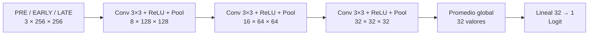

# Arquitectura actual: candidata CNN v2

Aprobada el 2026-10-01 por Álvaro. Implementada en models/cnn_v2.py; sin entrenar.
La referencia CNN v1 se conserva intacta en models/cnn_v1.py y se documenta en
[ARQUITECTURA_V1.md](ARQUITECTURA_V1.md). No hay modelo final elegido.

## Diseño horizontal

Una convolución por bloque, stride 1 y padding 1; MaxPool 2×2, stride 2.
Kaiming normal fan_in/ReLU, Xavier uniforme en salida y sesgos cero.
Sin BatchNorm ni dropout. Entrada PNG / 255; sin aumentos.
Después de la red: sigmoide por corte y media por paciente.

| Capa con pesos | Parámetros, incluidos sesgos |
|---|---:|
| Conv 3 → 8 | 224 |
| Conv 8 → 16 | 1.168 |
| Conv 16 → 32 | 4.640 |
| Lineal 32 → 1 | 33 |
| Total | **6.065** |

Único cambio de diseño frente a v1: reducir anchura de 16/32/64 a 8/16/32
(y adaptar la entrada de la capa final). V1 tiene 23.649 parámetros.
Hipótesis: menor capacidad podría reducir el sobreajuste; también podría
perder capacidad útil. No se garantiza mejora. No se añade otra convolución.

## Experimento aprobado

Adam, lr=0,001, weight_decay=0, BCE normal, semilla 42, lote 32, fold 0 de
validación, folds 1–4 de entrenamiento. Misma paciencia/máximo y revisiones
que v1. Ejecución exclusivamente por Álvaro, desde cero y en carpeta nueva.
Comandos en [ENTRENAMIENTO.md](ENTRENAMIENTO.md).
Objetivo orientativo de AUC ≥0,70, no requisito docente verificado ni garantía;
confirmación de finalistas en cinco folds según protocolo. Test reservado.
