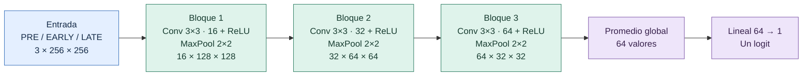

# Arquitectura actual: CNN v1

Referencia vigente del diseño acordado con Álvaro el 2026-09-30.
Estado: implementada en [models/cnn_v1.py](../models/cnn_v1.py); comprobaciones técnicas
superadas en RTX 3060 Ti el 2026-09-30. Primera comparación en fold 0 terminada:
normal se detuvo en época 36 (mejor AUC 0,602520, época 26); ponderada en época
11 (mejor AUC 0,561694, época 1). Son candidatos, no modelo final.
Normal obtiene mayor mejor AUC en este fold; selección final aún pendiente.
Mantener este documento actualizado cuando se acuerde un cambio de arquitectura,
identificando la versión y distinguiendo diseño, implementación y modelo entrenado.

## Diagrama horizontal

Dimensiones por corte: canales × alto × ancho, sin incluir el lote.
Cada bloque contiene una convolución, ReLU y MaxPool, en ese orden.



Después de la red: sigmoide del logit para obtener la probabilidad del corte;
media de las probabilidades de todos los cortes disponibles de la paciente.
Durante entrenamiento, BCEWithLogitsLoss recibe directamente el logit.

## Capas y parámetros

Convoluciones con stride 1, padding 1, dilatación 1 y sin agrupación;
MaxPool 2×2 con stride 2. Capas convolucionales y lineal con sesgos.

| Operación | Salida por corte | Parámetros entrenables |
|---|---|---:|
| Entrada float32, PNG / 255 | 3 × 256 × 256 | 0 |
| Conv 3 → 16, 3×3 + ReLU | 16 × 256 × 256 | 448 |
| MaxPool 2×2 | 16 × 128 × 128 | 0 |
| Conv 16 → 32, 3×3 + ReLU | 32 × 128 × 128 | 4.640 |
| MaxPool 2×2 | 32 × 64 × 64 | 0 |
| Conv 32 → 64, 3×3 + ReLU | 64 × 64 × 64 | 18.496 |
| MaxPool 2×2 | 64 × 32 × 32 | 0 |
| Promedio global espacial y conversión a vector | 64 | 0 |
| Lineal 64 → 1 | 1 logit | 65 |
| **Total calculado del diseño** | | **23.649** |

El conteo incluye sesgos y está contrastado con la implementación.
Sin dropout ni BatchNorm. Inicialización Kaiming en convoluciones, Xavier en
la capa final y sesgos cero. Detalles de implementación: Kaiming normal con
fan_in y nonlinearity=relu; Xavier uniforme con gain=1 en la salida.

## Configuración de entrenamiento acordada

- Adam, tasa base 0,001, weight_decay=0 y sin scheduler.
- Experimento siguiente aprobado el 2026-10-01: misma arquitectura con Adam
  weight_decay=0,0001, BCE normal y resto igual; parada por paciencia en época 11,
  mejor AUC 0,561391 (época 1). No mejora la referencia en este fold.
  La configuración efectiva de cada ejecución está en su config.json/checkpoint.
- Lote 32 probado en un paso completo con datos reales en RTX 3060 Ti, float32.
  Pico asignado por PyTorch: 472,565 MiB; reservado: 856 MiB. No representa toda
  la memoria del dispositivo ni certifica un entrenamiento completo o la GPU AMD.
- Semilla, comparación de pérdidas, parada y evaluación según
  [PROTOCOLO_EXPERIMENTAL.md](PROTOCOLO_EXPERIMENTAL.md).
- Primer entrenamiento parcial ejecutado por Álvaro: runs/cnn-v1-normal-fold0/.
  Parada en época 36; ponderada en runs/cnn-v1-ponderada-fold0/, parada en 11.
  Revisión registrada en DECISIONES_Y_ESTADO.md; sin evaluación test.

## Repetir la comprobación técnica

Desde la raíz, con el entorno cancer activado:

```text
python scripts/comprobar_models/cnn_v1.py --batch-size 32 --device cuda
```

Comprueba dimensiones, parámetros, gradientes finitos, actualización de todas
las capas con Adam e inferencia repetida con lote unitario. Ejecuta un paso
sintético y dos pasos reales independientes (BCE normal y ponderada), cada uno
desde el mismo inicio. Usa exclusivamente cortes de train, folds 1–4; calcula
pos_weight en todo ese subconjunto. Los pesos se descartan. No compara capacidad
predictiva, no evalúa validación/test ni guarda un modelo entrenado.
Informe local ignorado: reports/local/comprobacion_modelo.json.
Memorización ejecutada por Álvaro: ocho cortes, 200 pasos, BCE final 0,000715,
8/8 aciertos; véase MEMORIZACION.md. Próximo experimento pendiente de acuerdo.

Motivo de esta primera versión: empezar con un diseño pequeño y comprensible;
su capacidad y generalización se comprobarán con validación interna, no con test.
No se presupone que sea la mejor arquitectura.
